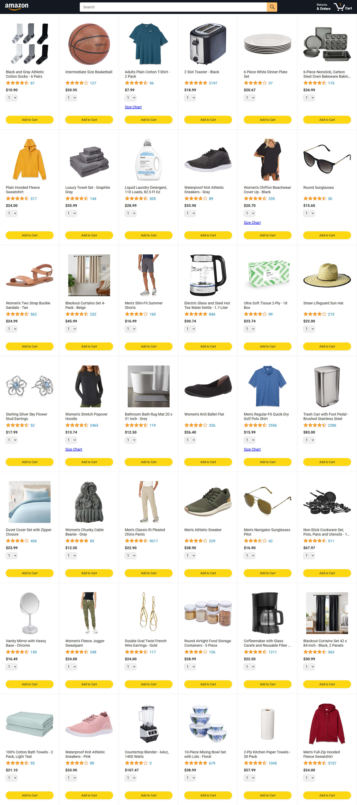

<div align="center">

# 🛒 Amazon Clone

### Multi-Page E-Commerce Frontend Application


<br>

### A responsive Amazon-inspired shopping experience built with vanilla HTML, CSS, and JavaScript

</div>

---

## 📸 Preview

<p align="center">
  
</p>

---

## 🧠 Overview

This project is a frontend recreation of Amazon's shopping experience, focusing on modern e-commerce UI patterns, dynamic cart functionality, order management, and multi-page navigation.

The goal was to practice building a realistic web application using only core web technologies without external frameworks.

---

## ✨ Features

- 🛒 Product browsing experience
- ➕ Add-to-cart functionality
- 🧾 Checkout workflow
- 📦 Orders page
- 🚚 Package tracking page
- 📱 Responsive layout
- ⚡ Dynamic JavaScript interactions
- 🎯 Modular project structure

---

## 🗂️ Pages Included

### 🏠 Home Page
Browse available products and add items to the cart.

### 💳 Checkout Page
Review cart contents and complete the checkout process.

### 📦 Orders Page
View previously placed orders.

### 🚚 Tracking Page
Track shipment progress and delivery status.

---

## 🏗️ Project Structure

```text
amazon-clone/
│
├── index.html
├── checkout.html
├── orders.html
├── tracking.html
│
├── data/
├── scripts/
├── styles/
├── images/
│
└── assets/
    └── screenshots/
```

---

## 🛠️ Tech Stack

### Frontend

- HTML5
- CSS3
- JavaScript (ES6)

### Development Concepts

- DOM Manipulation
- Modular JavaScript
- Responsive Design
- E-Commerce UI Patterns
- Client-Side State Management

---

## 🚀 Getting Started

### Clone the Repository

```bash
git clone https://github.com/zeyadbadawyy/amazon-clone.git
cd amazon-clone
```

### Run Locally

Open:

```text
index.html
```

in your browser.

---

## 🌐 Live Demo

Enable GitHub Pages and add your URL here:

```text
https://zeyadbadawyy.github.io/amazon-clone/
```

---

## 📈 Future Improvements

- User authentication
- Product search functionality
- Backend integration
- Payment gateway simulation
- Product reviews system
- Wishlist support

---

## 👨‍💻 Developer

**Zeyad Badawy**

Frontend Developer • Software Engineering Student • AI Enthusiast

---

## 📜 License

This project is intended for educational and portfolio purposes.

---

<div align="center">

### ⭐ If you found this project interesting, consider giving it a star!

</div>
